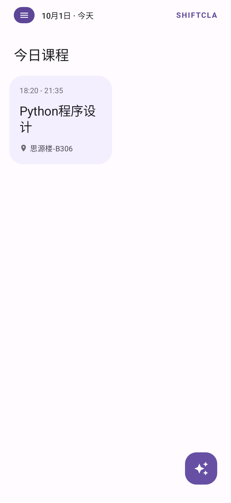
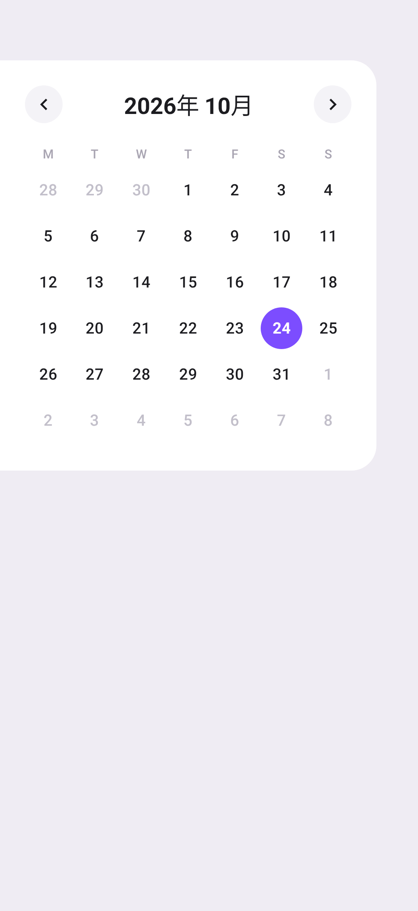
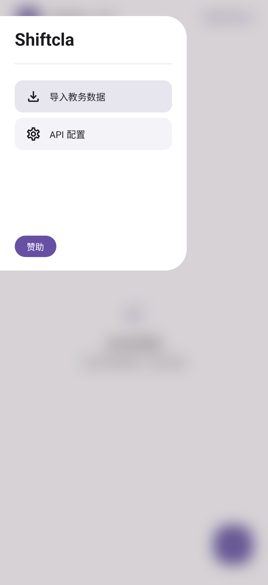
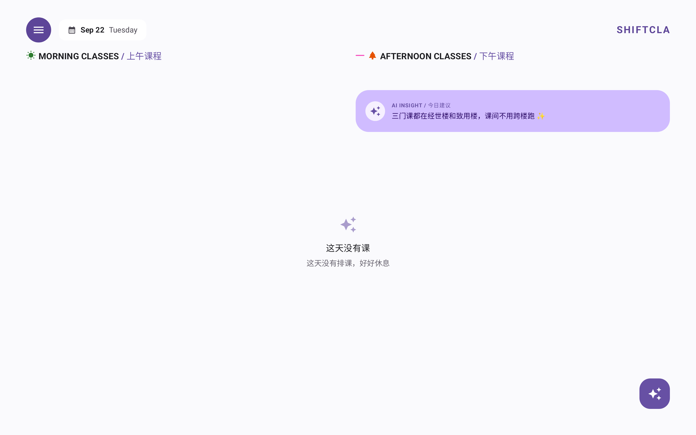

# Shiftcla

> 一个**离线优先**的课表 App。把教务系统的原始文本（或课表截图）丢给 AI，它帮你排成一张好看、好用的课表。

Jetpack Compose + Material 3 写的原生 Android 应用，手机 / 折叠屏 / 平板一套代码自适应。

## 下载安装

**[⬇️ 下载最新 APK](https://github.com/Damon-DDD/shiftcla/releases/latest)**（在 Releases 页面，需允许「安装未知来源应用」）

- 要求 Android 7.0（API 24）及以上
- 首次启动会要求填 API Key，**需要支持多模态（图文识别）的大模型**，否则课表截图解析不了。Key 只存本机，不会上传。

<p align="center">
  
  
  
</p>

<p align="center">
  
</p>

---

## 它解决什么问题

教务系统导出的课表基本没法看：一坨纯文本、周次藏在括号里、单双周写在小字里、换个学期还得重新对。

Shiftcla 的做法是：**你直接把教务那坨文本粘贴进来（或者截图丢进来），AI 负责解析**，
包括周次、单双周、上课时间、教室、老师这些细节，然后渲染成卡片瀑布流。

课表存在本机，**不联网也能看**——只有"导入/修改课表"那一步需要联网调 AI。

## 主要功能

- **AI 导入**：粘贴教务文本，或直接上课表截图（需要支持多模态的模型），AI 解析成结构化课程
- **多轮修改**：不满意可以继续对话改——「把高数换到 A-302」「删掉英语」，AI 基于当前课表做增量修改
- **一键清空**：说「清除所有课程」即可清空（本地识别，不消耗 AI 调用）
- **日期切换体系**：主界面左右滑动切换前/后一天，「回到当天课程」悬浮按钮，左侧日历抽屉（支持左右滑切月）
- **学期自动推断**：AI 从课表里读出开学日期，自动算出教学周；学期前/中/后三种空态各有对应文案
- **响应式布局**：手机 2 列 / 折叠屏 3 列 / 平板 4 列，断点由可用宽度反推，不写死
- **视觉细节**：错落瀑布流、卡片共享元素展开进详情、底图模糊、抽屉与日历的转场动画

## 技术栈

| 方面 | 选型 |
| --- | --- |
| 语言 / UI | Kotlin + Jetpack Compose + Material 3 |
| 大模型调用 | Ktor Client (OkHttp 引擎) + kotlinx.serialization |
| 日期 | `java.time`（minSdk 24 通过 core library desugaring 支持） |
| 持久化 | SharedPreferences（课表 / API Key / 学期信息） |
| 测试 | JVM 单测 107 条 + Compose 截图测试（离屏渲染 PNG 做视觉验收） |

## 上手

### 环境要求

- Android Studio（自带 JBR 即可，无需另装 JDK）
- Android SDK，compileSdk 36
- minSdk 24（Android 7.0）

### 构建

```bash
# 1. 指定 SDK 路径（换成你自己的）
echo "sdk.dir=/path/to/Android/sdk" > local.properties

# 2. 编译 Debug 包
./gradlew assembleDebug
# 产物：app/build/outputs/apk/debug/Shiftcla.apk
```

### 配置 AI

首次启动会弹出 API Key 配置框。填入自己的大模型 Key（**需要支持多模态**，否则课表截图解析不了）。

Key 只存在本机 SharedPreferences 里，不会上传到任何地方。

> 默认接的是 DeepSeek 的 Chat Completions 接口（`app/src/main/java/com/shiftcla/app/data/DeepSeekEngine.kt` 里的
> `ENDPOINT` / `MODEL`）。要换成别家兼容 OpenAI 格式的服务，改这两个常量即可。

### 发布签名

Release 包的签名配置按 **环境变量 → `keystore.properties` → 回退 debug** 三级查找，
所以 clone 下来不配任何密钥也能构建（只是产物是 debug 签名的，仅供自测）。

要用自己的正式密钥：

```bash
# 生成密钥（放在仓库外，避免误提交）
keytool -genkeypair -v -keystore ~/AndroidKeys/shiftcla-release.jks \
  -storetype PKCS12 -alias shiftcla -keyalg RSA -keysize 2048 -validity 10000

# 在仓库根目录建 keystore.properties（已被 .gitignore 排除）
cat > keystore.properties <<'EOF'
storeFile=/Users/you/AndroidKeys/shiftcla-release.jks
storePassword=你的口令
keyAlias=shiftcla
keyPassword=你的口令
EOF
```

> ⚠️ **密钥与口令务必备份**。Android 要求升级包与已安装包的签名一致，
> 密钥丢失后你将无法再发布可覆盖升级的新版本。

## 持续集成

`.github/workflows/android-ci.yml` 在 push / PR 时跑单元测试并构建 Release APK，
产物作为工作流 artifact 上传；给仓库打 `v*` 标签时会自动把 APK 附加到对应 Release。

CI 需要四个 Repository Secret：

| Secret | 说明 |
| --- | --- |
| `KEYSTORE_BASE64` | 密钥文件的 base64（`base64 -i release.jks`） |
| `KEYSTORE_PASSWORD` | 密钥库口令 |
| `KEY_ALIAS` | 密钥别名 |
| `KEY_PASSWORD` | 密钥口令 |

配置后执行 `git tag v1.0 && git push origin v1.0` 即可自动发版。

## 代码结构

```
app/src/main/java/com/shiftcla/app/
├── MainActivity.kt                  入口
├── data/
│   ├── ShiftclaData.kt              数据模型 + 本地存储（课表/Key/学期信息）
│   ├── ShiftclaDate.kt              日期与教学周运算（纯函数，可单测）
│   ├── DeepSeekEngine.kt            大模型调用 + 容错 JSON 解析 + 提示词
│   └── TermNote.kt                  学期结束语生成与缓存
└── ui/dashboard/
    ├── ShiftclaDashboard.kt         看板主界面（响应式网格 + Pager 切日 + FAB）
    ├── ShiftclaViewModel.kt         状态中枢（课表 / 选中日期 / 导入流程）
    ├── TodayCourses.kt              「某天有哪些课」的纯函数过滤
    ├── CourseDetailOverlay.kt       课程详情浮层 + 路由层
    ├── ShiftclaCalendar.kt          左侧日历抽屉
    ├── ShiftclaDrawer.kt            侧边导航抽屉
    ├── ImportBottomSheet.kt         AI 导入 / 对话面板
    ├── ApiKeyDialog.kt              API Key 配置
    └── EmptyState.kt                空态文案分支
```

## 测试

```bash
# JVM 单测
./gradlew testDebugUnitTest

# 截图测试：离屏把 @Preview 渲染成 PNG
./gradlew validateDebugScreenshotTest   # 与基准图比对
./gradlew updateDebugScreenshotTest     # 更新基准图
```

单测覆盖的是纯逻辑：教学周计算、按日期过滤、日期文案、空态分支、AI 返回的脏 JSON 容错解析等。

## License

[MIT](LICENSE)

## 赞助

如果这个 App 帮到你，可以请我喝杯咖啡：<https://afdian.com/a/DamonDDD>
